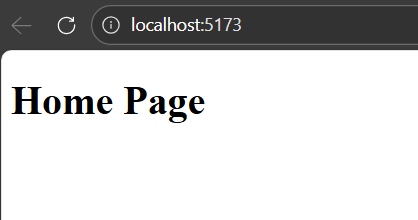
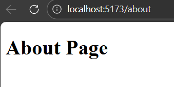
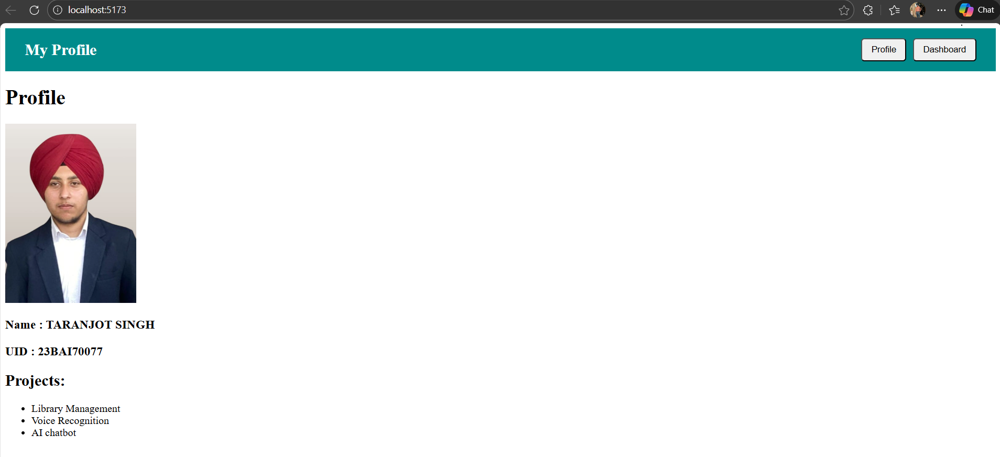
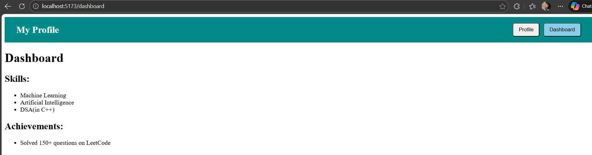

# Experiment 3 — React Routing and Navigation

## Aim
To implement client-side routing in React using React Router DOM and build a multi-page application with navigation between components.

---

## Tools Used
- React.js
- React Router DOM
- JavaScript
- HTML & CSS
- Vite

---

# 🔹 Experiment 3.1 — Basic Routing (Home & About)

## Aim
To create basic routing between Home and About pages using BrowserRouter, Routes and Route.

## What I Used
- BrowserRouter
- Routes
- Route
- Functional Components

## Screenshots

### Home Page

### About Page

---

# 🔹 Experiment 3.2 — Profile Page with Header

## Aim
To create a profile page with a header and navigation using Link.

## What I Used
- Link component
- Header navigation
- CSS Flexbox
- Profile component

## Screenshots

### Profile with Header

### Profile Details

---

# 🔹 Experiment 3.3 — Dashboard Routing

## Aim
To add a dashboard page and enable navigation between profile and dashboard.

## What I Used
- Multiple routes
- Navigation buttons
- Dashboard component
- React Router navigation

## Screenshots

### Dashboard Page

### Dashboard Details

---

## Result
Routing between multiple React components was successfully implemented without page reload.

---

## Student Details
Name: Taranjot Singh  
UID: 23BAI70077  
Course: B.E CSE (AI/ML)
